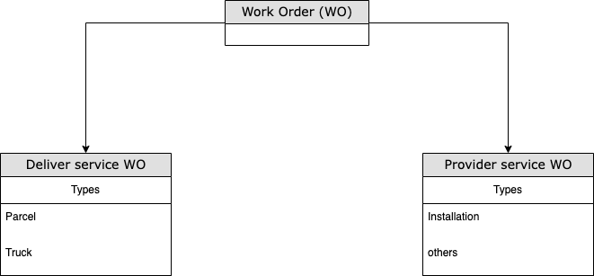
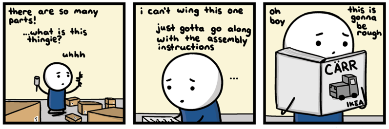
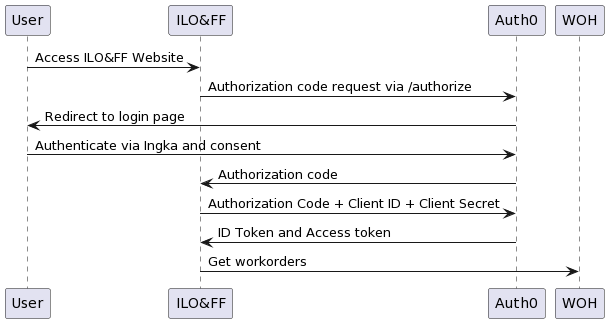
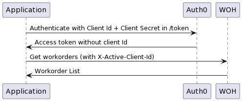
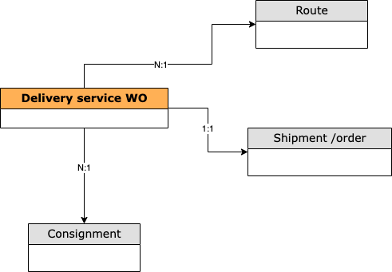
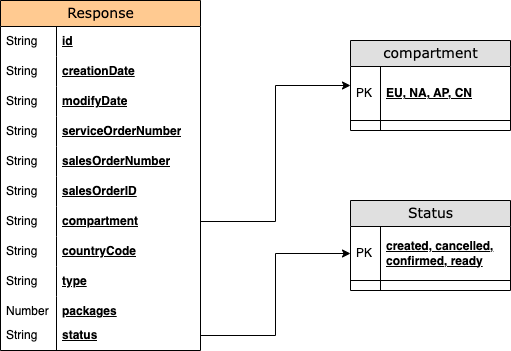

# Introduction

### Welcome to Work order management 👋 

Our APIs provide the capabilities to efficiently manage both provider and deliver service work orders

The difference between provider and deliver service work orders ? delivery service work orders are the physical order items (like parcels, trucks, etc.,) and provider service work orders handles the service request like (kitchen installation)

<p align="center" width="100%">
    
</p>

Let's start with work order `Business Object model` of work order

<p align="center" width="100%">
    
</p>


# Getting started

We offer both synchronous (REST) and asynchronous APIS. You can interact with both APIs using GitHub CLI, curl, the official Octokit libraries, and third party libraries. Occasionally, a feature may be supported on one API but not the other.

You should use the API that best aligns with your needs and that you are most comfortable using. You don't need to exclusively use one API over the other. Node IDs let you move between the REST API and Async API. For more information, see "Using global node IDs."

This article discusses the benefits of each API. For more information about the GraphQL API, see "About the Async API." For more information about the REST API, see the REST documentation.

How can you use our APIs ?

<p align="center" width="100%">
    
</p>

Let's start with the business object model. The main business object is the work order which contains packages and usually has items.

The shipment has a reference and contains, among other things, information about the shipper, recipient, shipping date, terms of delivery, carrier, and service.


# Authentication

### Authorization Code Flow
[Authorization Code Flow](https://auth0.com/docs/get-started/authentication-and-authorization-flow/authorization-code-flow)
is the current Authentication/Authorization mechanism ILO&FF apps is using. In that flow, the application will connect with
the identity provider (Auth0) to validate the identity of the user (via a challenge, in this case requesting the user
IKEA credentials) and will return a JWT token containing the claims the identity has. In this claims, the token will contain
the 'active_client_id' that WOH will use to retrieve all the attributes related to it and augment the SecurityIdentity
to grant or revoke the access to the resources based on the policies defined.

<p align="center" width="100%">
    
</p>

### Client Credentials Flow

[Client Credentials flow](https://auth0.com/docs/get-started/authentication-and-authorization-flow/client-credentials-flow) is the  
authentication/authorization flow best suited for m2m communication.

External parties and our e2e testing will use this flow as a way to operate with our API. As with the Authorization Code flow,
the token returned by the Identity Provider (in this case Auth0) should contain all the claims assigned to the application,
included the active client id. However, due to the high cost of integrating Auth0 with Auth Service via Hooks (as explained
[here](https://allen.ingka.com/docs/default/component/auth-service/docs/Decisions/Custom_claims_via_Auth0#:~:text=an%20existing%20hook.-,Note,-%3A%20IAM%20team%20is))
the JWT token returned by Auth0 won't contain the active client id information.

As a temporary solution, the WOH service will accept a new HTTP Header (X-Active-Client-Id) the API consumers can use to
specify what's the active client id they are trying to use. If the JWT token doesn't contain an active_client_id claim,
the application will use the HTTP Header to validate the user has access to the requested resources.

<p align="center" width="100%">
    
</p>

Example curl requests to perform the call:
1. Retrieve JWT token:
```
   curl --location 'https://icow.accounts.ingka.com/oauth/token' \
   --header 'Content-Type: application/json' \
   --data '{
   "client_id": "<application client id>",
   "client_secret": "<application client secret>",
   "grant_type": "client_credentials",
   "audience": "https://api.ingka.ikea.com",
   "auth_service_system": "<application name>",
   "auth_service_active_client_id": <active client id>
   }'
```

Right now, auth_service_system and auth_service_active_client_id won't do anything. In the future, Auth0 should return
those as part of the claims in the Authorization Token.

The url and the audience will change depending on the environment used.

2. Connect to WOH
```
   curl --location 'https://api.ingka.cte.ikeadt.com/work-order-manager/work-order-service/workorders' \
   --header 'X-Backend-Service-Authorization: Bearer <Token received in Step 1>
   --header 'X-Client-Id: <Application client id>' \
   --header 'X-Active-Client-Id: <active client id>' \
```

## Links
* [Authentication Service](https://allen.ingka.com/docs/default/component/auth-service/docs/Decisions/Authentication_Service)
* [Custom Claims in Auth0](https://allen.ingka.com/docs/default/component/auth-service/docs/Decisions/Custom_claims_via_Auth0)

# Delivery services

<p>The team worked closely with us to define our requirements, delivering the project over agreed phases to time and on budget</p>

<p align="center" width="100%">
    
</p>

<details>
    <summary>Retrieve a single delivery service work order</summary>
    <p> This endpoint allows you to retrieve a list of all the parcels which you have created or imported into your account under your API credentials. You can filter the results based on the query parameters provided below, in order to retrieve a specific parcel or list of parcels which match the defined criteria.
        <h4>GET /api/v2/parcels</h4>
        <details><summary>Show more</summary>
            <h4>Request sample: Shell or cURL</h4>
            <code style="display:block; white-space:pre-wrap">curl --request GET 
             --url https://ingka.ikea.com/api/v2/parcels
             --header 'Accept: application/json' 
             --header 'Authorization: Basic undefined'
            </code>
        <h4>200: Response sample</h4>
        <code style="display:block; white-space:pre-wrap">{
  "id": "",
  "creationDate": "2023-05-31T10:16:17+02:00",
  "modifyDate": "2023-05-31T10:16:17+02:00",
  "serviceOrderNumber": "16137437266",
  "salesOrderId": "IKSE3726662",
  "compartment": "EU",
  "countryCode": "NL",
  "type": "Pick up points",
  "packages": 42,
  "status": "Created",
  "deliveryDate": "2022-05-31T14:00:00",
  "originalDeliveryWindowUTC": {
    "from": "",
    "to": ""
  },
  "cdus": null,
  "addresses": null,
  "orderLines": null,
  "serviceProvider": {
    "carrierServiceDescription": "",
    "carrierDescription": "",
    "carrierService": "",
    "carrier": "",
    "tspId": "99002"
  },
  "trackingEvents": null,
  "shipmentTrackingStatus": "Picked up by customer",
  "carrier": {
    "id": "",
    "label": ""
  },
  "nodeKey": "LSC.2533",
  "deliveryMethod": {
    "code": "",
    "name": ""
  },
  "shippingBusinessUnits": null,
  "sellingBusinessUnit": "STO.949",
  "deliveryPostalCode": "1054wn",
  "promisedDeliveryWindowUTC": {
    "from": "",
    "to": "",
    "timezone": ""
  }
}
            </code>
         <h4>400: Response sample</h4>
        <code style="display:block; white-space:pre-wrap">curl --request GET 
             --url https://ingka.ikea.com/api/v2/parcels
             --header 'Accept: application/json' 
             --header 'Authorization: Basic undefined'
            </code> 
        <h4>Response shcema object model</h4>
        <p align="center" width="100%">
            
        </p>
        </details>
</details>

<details>
    <summary>Retrieve all delivery service work orders</summary>
    <p> This endpoint allows you to retrieve a list of all the parcels which you have created or imported into your account under your API credentials. You can filter the results based on the query parameters provided below, in order to retrieve a specific parcel or list of parcels which match the defined criteria.
        <h4>GET /api/v2/parcels</h4>
        <details><summary>Show more</summary>
            <h4>Request sample: Shell or cURL</h4>
            <code style="display:block; white-space:pre-wrap">curl --request GET 
             --url https://ingka.ikea.com/api/v2/parcels
             --header 'Accept: application/json' 
             --header 'Authorization: Basic undefined'
            </code>
        <h4>200: Response sample</h4>
        <code style="display:block; white-space:pre-wrap">{
  "id": "",
  "creationDate": "2023-05-31T10:16:17+02:00",
  "modifyDate": "2023-05-31T10:16:17+02:00",
  "serviceOrderNumber": "16137437266",
  "salesOrderId": "IKSE3726662",
  "compartment": "EU",
  "countryCode": "NL",
  "type": "Pick up points",
  "packages": 42,
  "status": "Created",
  "deliveryDate": "2022-05-31T14:00:00",
  "originalDeliveryWindowUTC": {
    "from": "",
    "to": ""
  },
  "cdus": null,
  "addresses": null,
  "orderLines": null,
  "serviceProvider": {
    "carrierServiceDescription": "",
    "carrierDescription": "",
    "carrierService": "",
    "carrier": "",
    "tspId": "99002"
  },
  "trackingEvents": null,
  "shipmentTrackingStatus": "Picked up by customer",
  "carrier": {
    "id": "",
    "label": ""
  },
  "nodeKey": "LSC.2533",
  "deliveryMethod": {
    "code": "",
    "name": ""
  },
  "shippingBusinessUnits": null,
  "sellingBusinessUnit": "STO.949",
  "deliveryPostalCode": "1054wn",
  "promisedDeliveryWindowUTC": {
    "from": "",
    "to": "",
    "timezone": ""
  }
}
            </code>
         <h4>400: Response sample</h4>
        <code style="display:block; white-space:pre-wrap">curl --request GET 
             --url https://ingka.ikea.com/api/v2/parcels
             --header 'Accept: application/json' 
             --header 'Authorization: Basic undefined'
            </code> 
        <h4>Response shcema object model</h4>
        <p align="center" width="100%">
            
        </p>
        </details>
</details>

<details>
    <summary>Create a new delivery service work order</summary>
    <p> This endpoint allows you to retrieve a list of all the parcels which you have created or imported into your account under your API credentials. You can filter the results based on the query parameters provided below, in order to retrieve a specific parcel or list of parcels which match the defined criteria.
        <h4>GET /api/v2/parcels</h4>
        <details><summary>Show more</summary>
            <h4>Request sample: Shell or cURL</h4>
            <code style="display:block; white-space:pre-wrap">curl --request GET 
             --url https://ingka.ikea.com/api/v2/parcels
             --header 'Accept: application/json' 
             --header 'Authorization: Basic undefined'
            </code>
        <h4>200: Response sample</h4>
        <code style="display:block; white-space:pre-wrap">{
  "id": "",
  "creationDate": "2023-05-31T10:16:17+02:00",
  "modifyDate": "2023-05-31T10:16:17+02:00",
  "serviceOrderNumber": "16137437266",
  "salesOrderId": "IKSE3726662",
  "compartment": "EU",
  "countryCode": "NL",
  "type": "Pick up points",
  "packages": 42,
  "status": "Created",
  "deliveryDate": "2022-05-31T14:00:00",
  "originalDeliveryWindowUTC": {
    "from": "",
    "to": ""
  },
  "cdus": null,
  "addresses": null,
  "orderLines": null,
  "serviceProvider": {
    "carrierServiceDescription": "",
    "carrierDescription": "",
    "carrierService": "",
    "carrier": "",
    "tspId": "99002"
  },
  "trackingEvents": null,
  "shipmentTrackingStatus": "Picked up by customer",
  "carrier": {
    "id": "",
    "label": ""
  },
  "nodeKey": "LSC.2533",
  "deliveryMethod": {
    "code": "",
    "name": ""
  },
  "shippingBusinessUnits": null,
  "sellingBusinessUnit": "STO.949",
  "deliveryPostalCode": "1054wn",
  "promisedDeliveryWindowUTC": {
    "from": "",
    "to": "",
    "timezone": ""
  }
}
            </code>
         <h4>400: Response sample</h4>
        <code style="display:block; white-space:pre-wrap">curl --request GET 
             --url https://ingka.ikea.com/api/v2/parcels
             --header 'Accept: application/json' 
             --header 'Authorization: Basic undefined'
            </code> 
        <h4>Response shcema object model</h4>
        <p align="center" width="100%">
            
        </p>
        </details>
</details>

# Provided services

<p>The team worked closely with us to define our requirements, delivering the project over agreed phases to time and on budget</p>

<p align="center" width="100%">
    
</p>

<details>
    <summary>Retrieve a single provider service work order</summary>
    <p> This endpoint allows you to retrieve a list of all the parcels which you have created or imported into your account under your API credentials. You can filter the results based on the query parameters provided below, in order to retrieve a specific parcel or list of parcels which match the defined criteria.
        <h4>GET /api/v2/parcels</h4>
        <details><summary>Show more</summary>
            <h4>Request sample: Shell or cURL</h4>
            <code style="display:block; white-space:pre-wrap">curl --request GET 
             --url https://ingka.ikea.com/api/v2/parcels
             --header 'Accept: application/json' 
             --header 'Authorization: Basic undefined'
            </code>
        <h4>200: Response sample</h4>
        <code style="display:block; white-space:pre-wrap">{
  "id": "",
  "creationDate": "2023-05-31T10:16:17+02:00",
  "modifyDate": "2023-05-31T10:16:17+02:00",
  "serviceOrderNumber": "16137437266",
  "salesOrderId": "IKSE3726662",
  "compartment": "EU",
  "countryCode": "NL",
  "type": "Pick up points",
  "packages": 42,
  "status": "Created",
  "deliveryDate": "2022-05-31T14:00:00",
  "originalDeliveryWindowUTC": {
    "from": "",
    "to": ""
  },
  "cdus": null,
  "addresses": null,
  "orderLines": null,
  "serviceProvider": {
    "carrierServiceDescription": "",
    "carrierDescription": "",
    "carrierService": "",
    "carrier": "",
    "tspId": "99002"
  },
  "trackingEvents": null,
  "shipmentTrackingStatus": "Picked up by customer",
  "carrier": {
    "id": "",
    "label": ""
  },
  "nodeKey": "LSC.2533",
  "deliveryMethod": {
    "code": "",
    "name": ""
  },
  "shippingBusinessUnits": null,
  "sellingBusinessUnit": "STO.949",
  "deliveryPostalCode": "1054wn",
  "promisedDeliveryWindowUTC": {
    "from": "",
    "to": "",
    "timezone": ""
  }
}
            </code>
         <h4>400: Response sample</h4>
        <code style="display:block; white-space:pre-wrap">curl --request GET 
             --url https://ingka.ikea.com/api/v2/parcels
             --header 'Accept: application/json' 
             --header 'Authorization: Basic undefined'
            </code> 
        <h4>Response shcema object model</h4>
        <p align="center" width="100%">
            
        </p>
        </details>
</details>

<details>
    <summary>Retrieve all provider service work orders</summary>
    <p> This endpoint allows you to retrieve a list of all the parcels which you have created or imported into your account under your API credentials. You can filter the results based on the query parameters provided below, in order to retrieve a specific parcel or list of parcels which match the defined criteria.
        <h4>GET /api/v2/parcels</h4>
        <details><summary>Show more</summary>
            <h4>Request sample: Shell or cURL</h4>
            <code style="display:block; white-space:pre-wrap">curl --request GET 
             --url https://ingka.ikea.com/api/v2/parcels
             --header 'Accept: application/json' 
             --header 'Authorization: Basic undefined'
            </code>
        <h4>200: Response sample</h4>
        <code style="display:block; white-space:pre-wrap">{
  "id": "",
  "creationDate": "2023-05-31T10:16:17+02:00",
  "modifyDate": "2023-05-31T10:16:17+02:00",
  "serviceOrderNumber": "16137437266",
  "salesOrderId": "IKSE3726662",
  "compartment": "EU",
  "countryCode": "NL",
  "type": "Pick up points",
  "packages": 42,
  "status": "Created",
  "deliveryDate": "2022-05-31T14:00:00",
  "originalDeliveryWindowUTC": {
    "from": "",
    "to": ""
  },
  "cdus": null,
  "addresses": null,
  "orderLines": null,
  "serviceProvider": {
    "carrierServiceDescription": "",
    "carrierDescription": "",
    "carrierService": "",
    "carrier": "",
    "tspId": "99002"
  },
  "trackingEvents": null,
  "shipmentTrackingStatus": "Picked up by customer",
  "carrier": {
    "id": "",
    "label": ""
  },
  "nodeKey": "LSC.2533",
  "deliveryMethod": {
    "code": "",
    "name": ""
  },
  "shippingBusinessUnits": null,
  "sellingBusinessUnit": "STO.949",
  "deliveryPostalCode": "1054wn",
  "promisedDeliveryWindowUTC": {
    "from": "",
    "to": "",
    "timezone": ""
  }
}
            </code>
         <h4>400: Response sample</h4>
        <code style="display:block; white-space:pre-wrap">curl --request GET 
             --url https://ingka.ikea.com/api/v2/parcels
             --header 'Accept: application/json' 
             --header 'Authorization: Basic undefined'
            </code> 
        <h4>Response shcema object model</h4>
        <p align="center" width="100%">
            
        </p>
        </details>
</details>

<details>
    <summary>Create a new provider service work order</summary>
    <p> This endpoint allows you to retrieve a list of all the parcels which you have created or imported into your account under your API credentials. You can filter the results based on the query parameters provided below, in order to retrieve a specific parcel or list of parcels which match the defined criteria.
        <h4>GET /api/v2/parcels</h4>
        <details><summary>Show more</summary>
            <h4>Request sample: Shell or cURL</h4>
            <code style="display:block; white-space:pre-wrap">curl --request GET 
             --url https://ingka.ikea.com/api/v2/parcels
             --header 'Accept: application/json' 
             --header 'Authorization: Basic undefined'
            </code>
        <h4>200: Response sample</h4>
        <code style="display:block; white-space:pre-wrap">{
  "id": "",
  "creationDate": "2023-05-31T10:16:17+02:00",
  "modifyDate": "2023-05-31T10:16:17+02:00",
  "serviceOrderNumber": "16137437266",
  "salesOrderId": "IKSE3726662",
  "compartment": "EU",
  "countryCode": "NL",
  "type": "Pick up points",
  "packages": 42,
  "status": "Created",
  "deliveryDate": "2022-05-31T14:00:00",
  "originalDeliveryWindowUTC": {
    "from": "",
    "to": ""
  },
  "cdus": null,
  "addresses": null,
  "orderLines": null,
  "serviceProvider": {
    "carrierServiceDescription": "",
    "carrierDescription": "",
    "carrierService": "",
    "carrier": "",
    "tspId": "99002"
  },
  "trackingEvents": null,
  "shipmentTrackingStatus": "Picked up by customer",
  "carrier": {
    "id": "",
    "label": ""
  },
  "nodeKey": "LSC.2533",
  "deliveryMethod": {
    "code": "",
    "name": ""
  },
  "shippingBusinessUnits": null,
  "sellingBusinessUnit": "STO.949",
  "deliveryPostalCode": "1054wn",
  "promisedDeliveryWindowUTC": {
    "from": "",
    "to": "",
    "timezone": ""
  }
}
            </code>
         <h4>400: Response sample</h4>
        <code style="display:block; white-space:pre-wrap">curl --request GET 
             --url https://ingka.ikea.com/api/v2/parcels
             --header 'Accept: application/json' 
             --header 'Authorization: Basic undefined'
            </code> 
        <h4>Response shcema object model</h4>
        <p align="center" width="100%">
            
        </p>
        </details>
</details>

# Labels